## How it works

<table>
  <tr>
    <th width="25%">Link</th>
    <th width="25%">Format</th>
    <th width="25%">Quality</th>
    <th width="25%">Result</th>
  </tr>
  <tr align="center">
    <td><code>https://…</code></td>
    <td>Audio (mp3) Video (mp4)</td>
    <td>480p 720p 1080p</td>
    <td><b>file in chat</b></td>
  </tr>
</table>

> Spotify & SoundCloud are **audio-only** - the bot shows only the audio button.

## Platforms

<table>
  <tr>
    <td align="center" width="25%">
       
      <b>YouTube</b> video/audio
    </td>
    <td align="center" width="25%">
       
      <b>Spotify</b> audio
    </td>
    <td align="center" width="25%">
       
      <b>SoundCloud</b> audio
    </td>
    <td align="center" width="25%">
       
      <b>TikTok</b> video/audio
    </td>
  </tr>
  <tr>
    <td align="center">
       
      <b>Instagram</b> video/audio
    </td>
    <td align="center">
       
      <b>Facebook</b> video/audio
    </td>
    <td align="center">
       
      <b>Reddit</b> video/audio
    </td>
    <td align="center">
       
      <b>Pinterest</b> video/audio
    </td>
  </tr>
  <tr>
    <td align="center">
       
      <b>VK</b> video/audio
    </td>
    <td align="center">
       
      <b>Twitter</b> video/audio
    </td>
    <td align="center">
       
      <b>Rumble</b> video/audio
    </td>
    <td align="center">
       
      <b>Snapchat</b> video/audio
    </td>
  </tr>
</table>

This is a whitelist of platforms supported by the bot. If your service is not listed here, the bot will not be able to extract audio or video from a link posted on an unsupported service.

## Features

<table>
  <tr>
    <td width="50%">
      <b>Clean audio</b> 
      Best available mp3, no quality guessing
    </td>
    <td width="50%">
      <b>Three qualities</b> 
      480p · 720p · 1080p per request
    </td>
  </tr>
  <tr>
    <td>
      <b>Straight to chat</b> 
      No links, no ads, no landing pages
    </td>
    <td>
      <b>Groups & private</b> 
      Works in any chat you add it to
    </td>
  </tr>
</table>

## Notes

| | |
|:--|:--|
| **Personal use only** | May violate platform ToS; Telegram can block music bots |
| **Restricted media** | Links to private / 18+ / region-restricted video and audio files may not be available for download |
| **File size** | Up to 2 GB per file |

  

  <a href="LICENSE">License</a>
   · 
  <a href="docs/privacy-policy.md">Privacy Policy</a>

