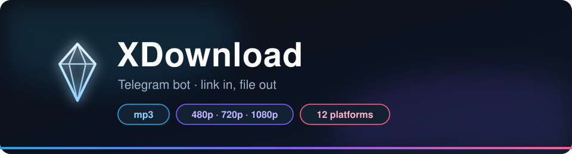

<div align="center">



<br/><br/>

[How it works](#-how-it-works) ·
[Platforms](#-platforms) ·
[Features](#-features) ·
[Notes](#-notes)

</div>

---

## 🎬 How it works

```
 link                  format                quality               file
────────────────────────────────────────────────────────────────────────
 https://…      →     🎵 Audio            →   —              →     📁 mp3
                      🎬 Video            →   480 / 720 / 1080p →  📁 mp4
```

Spotify & SoundCloud are audio-only — only the audio button appears.

---

## 🌍 Platforms

| | | | |
|:--:|:--:|:--:|:--:|
| ▶️ YouTube | 🟢 Spotify | 🟠 SoundCloud | ⬛ TikTok |
| 📷 Instagram | 🔵 Facebook | 🔴 Reddit | 📌 Pinterest |
| 🔵 VK | 𝕏 X (Twitter) | 🟡 Rumble | 👻 Snapchat |

- **Audio** — every platform (Spotify at 320 kbps)
- **Video** — everything except Spotify & SoundCloud
- Anything else → declined

---

## 🚀 Features

- **🎧 Clean mp3** — best available bitrate, no guessing
- **🎬 3 qualities** — 480p · 720p · 1080p per request
- **⚡ Straight to chat** — no links, no ads, no landing pages
- **🛡️ Anti-spam** — 1 link / 5 s, one download at a time
- **👥 Groups & private** — add it anywhere
- **📦 Smart fallback** — too big? quality is lowered automatically

---

## ⚠️ Notes

- **Personal use only** — may violate platform ToS; Telegram can block music bots
- Private / 18+ / region-locked media may fail
- Public Bot API ≈ 50 MB; local server raises the limit
- Nothing stored → [Privacy Policy](docs/privacy-policy.md)

---

<div align="center">

[License](LICENSE) · [Privacy](docs/privacy-policy.md)

</div>
